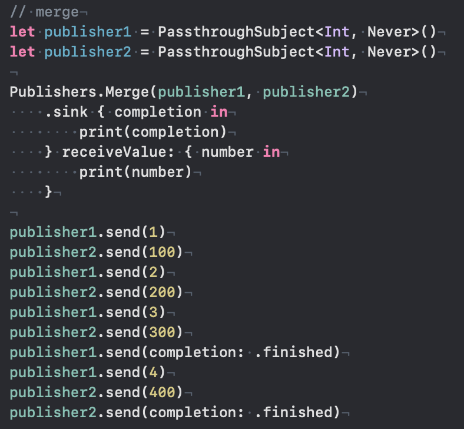
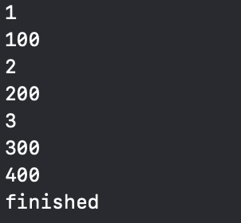
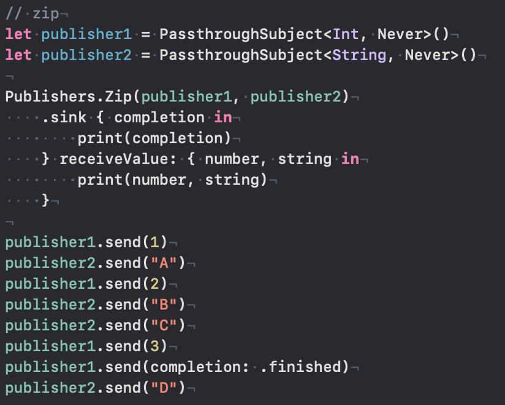
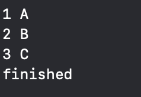
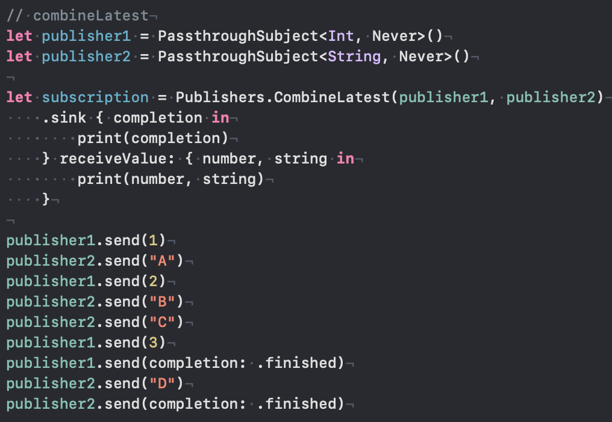
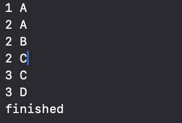
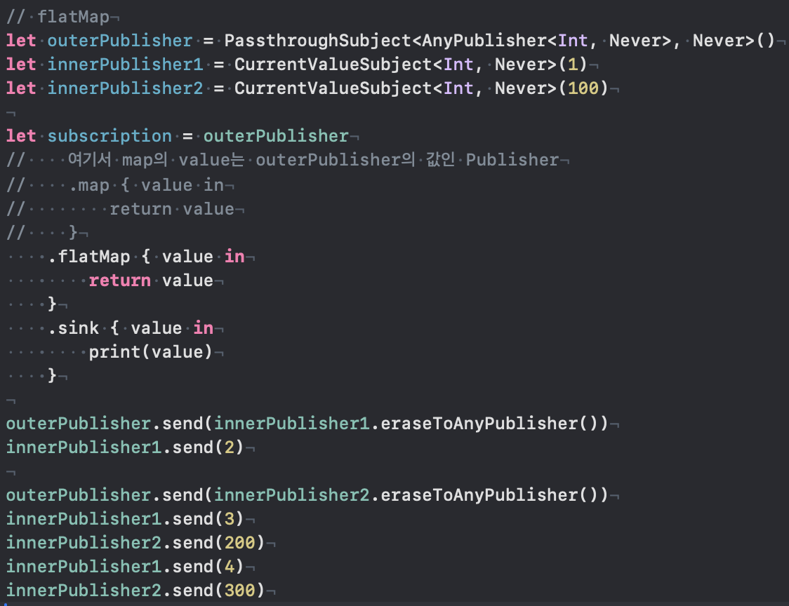
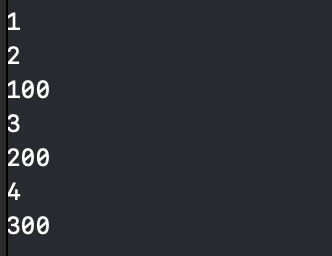
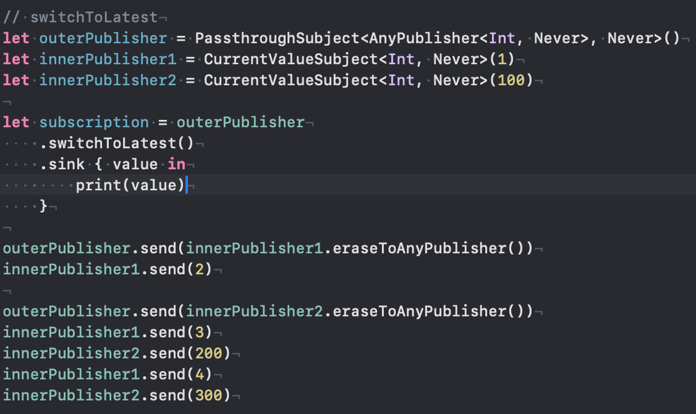
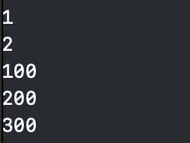

# Combining Operator

## merge

- 두 개의 퍼블리셔를 하나의 스트림으로 합치는 Operator.
- 두 개의 퍼블리셔가 finished 되어야 합쳐진 스트림이 finished 된다.
- 위 스크린샷을 보면, publisher1이 finished 된 후 값을 방출해도, 합쳐진 퍼블리셔는 이벤트를 받지 않는다.
- 또한, publisher2가 finished되지 않는 한 합쳐진 퍼블리셔는 finished 되지 않는다. 

## zip

- 두 퍼블리셔가 방출하는 값을 하나로 짝짓는다.
- 두 퍼블리셔의 타입이 달라도 상관없다.
- 두 퍼블리셔 중 하나라도 finished 되면 finish된다.

## combineLatest

- zip Operator와 마찬가지로 두 퍼블리셔가 방출하는 값을 하나로 짝짓는다.
- 다만, 다른 점은 두 퍼블리셔 중 최근 값이 방출되면, 최근 방출된 값끼리 짝짓는다.
- 즉, 한 퍼블리셔만 업데이트 되도, 새로운 값을 방출할 수 있다.
- 두 퍼블리셔가 finish 되어야 finish 된다.

## flatMap

- 원본 스트림(퍼블리셔가 담겨있는 퍼블리셔)을 기준으로 각각의 내부 퍼블리셔에서 방출하는 값을 합쳐서 새로운 퍼블리셔를 만드는 Operator.
- innerPublisher1을 방출하는 시점에 innerPublisher1의 초기값인 1을 방출.

## switchToLatest

- flatMap Operator와 동일하게 원본 스트림(퍼블리셔가 담겨있는 퍼블리셔)을 기준으로 각각의 내부 퍼블리셔가 존재한다.
- 차이점으로는 내부 퍼블리셔 중 하나를 세팅하고 값을 방출하다가, 다른 내부 퍼블리셔가 세팅되는 순간 기존 내부 퍼블리셔가 사라진다.
- 이후 값을 방출할 때, 기존에 방출했던 퍼블리셔(innerPublisher1)가 방출하는 값을 더 이상 받지 않는다.
