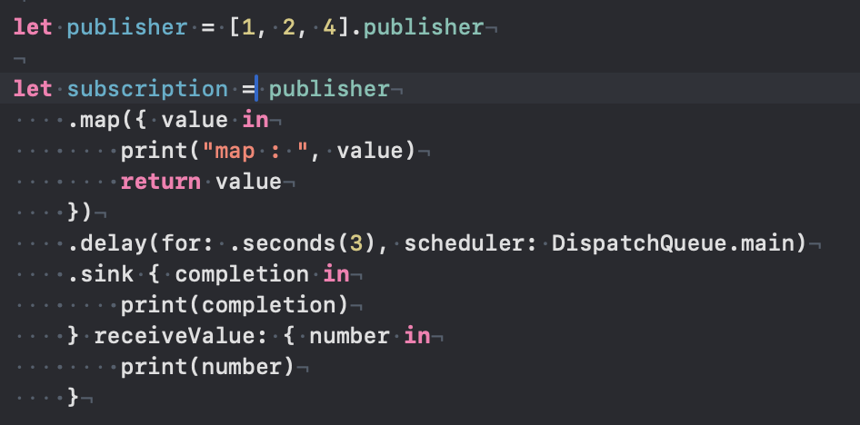
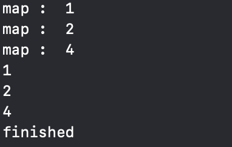
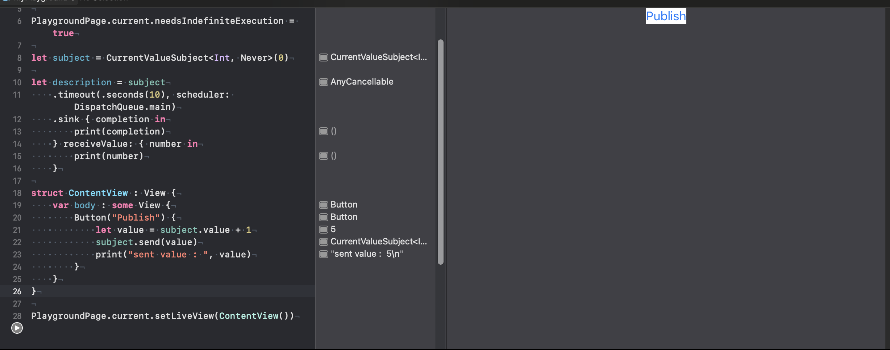
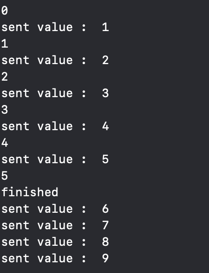
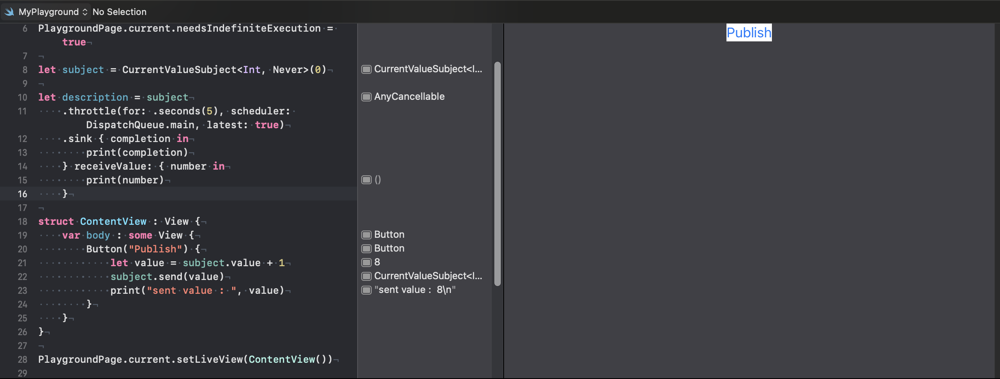
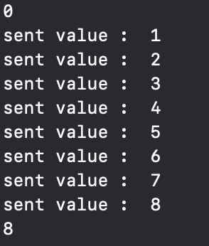
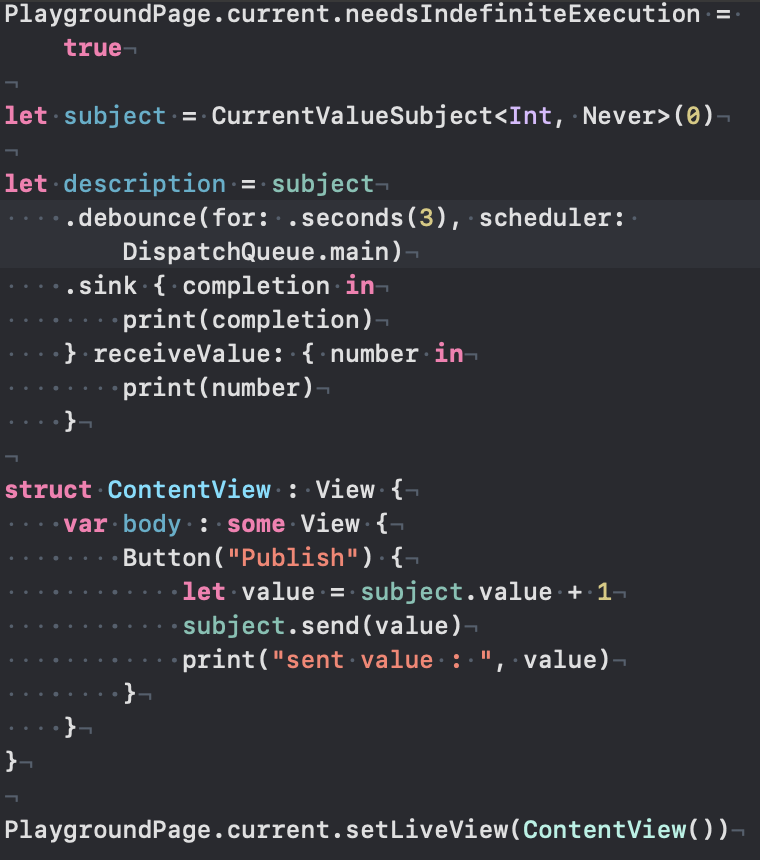
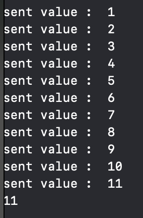

# Time Controlling Operator

## delay

- 값을 방출하는 시간을 지연하는 오퍼레이터.

## timeout

- 설정한 시간만큼 기다렸다가, 방출이 안되면 해당 퍼블리셔를 finish 처리함.

## throttle

- 퍼블리셔가 많은 데이터를 방출할 때, 해당 퍼블리셔를 구독하고 있는 subscriber가 데이터 하나하나 처리하기 어렵다.
- 위와 같은 이유로, throttle과 debounce 오퍼레이터를 사용해 데이터를 선별하여 방출한다.
- throttle은 지정한 시간동안 방출되는 요소 중 하나를 선별해 방출한다.
- latest(Bool) 값을 설정함에 따라 구간 내 방출하는 요소가 달라진다.

## debounce

- throttle과 동일하게 값을 선별하여 방출한다.
- debounce는 요소를 방출할 동안 대기하고 있다가, 설정한 시간 동안 값의 방출이 없을 경우 마지막 값을 방출한다.