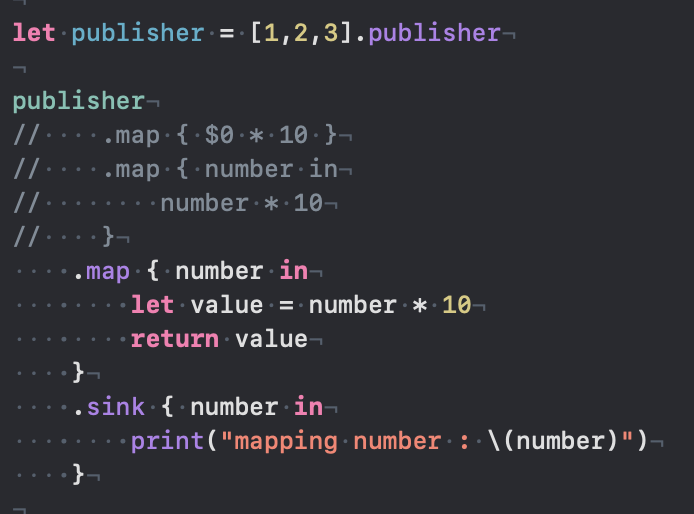
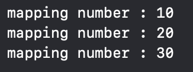
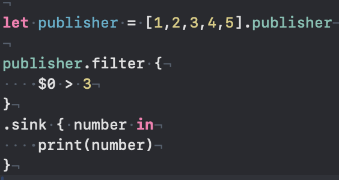
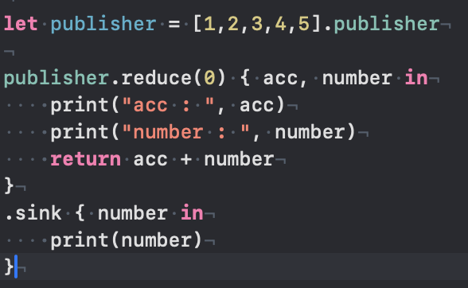
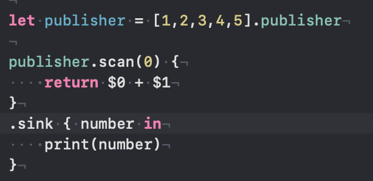
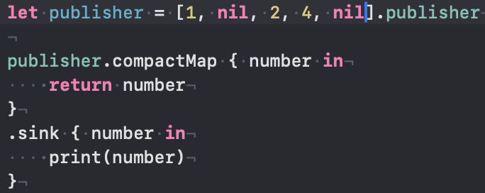

# Operator
- Operator는 Publisher가 방출하는 값에 변형, 필터링, 결합 등의 작업을 수행하는 메서드다. 데이터 스트림을 가공하고 조작하는 역할을 함.

## Basic Operator

### map

- 클로저 내부에 구현한 연산을 진행하고, 그 결과를 기반으로 Publisher를 리턴한다.
 
### filter

- 클로저에 true/false를 판단하는 연산을 진행하고, true를 만족하는 값으로 구성된 Publisher를 리턴한다.

### reduce

- 초기값을 설정하고, 퍼블리셔의 배열 원소를 합친다.
- 클로저 내 예외 조건을 추가하여, 다른 결과로 나타낼 수 있다.

### scan

- 초기값을 설정하고, 퍼블리셔의 배열 원소를 합친다. (reduce와 비슷함)
- reduce와 다른점은 계산된 결과가 단계별 결과값으로 출력된다.

### compactMap

- 요소에 nil이 있을 경우 해당 값을 제외한 결과값을 방출한다.

### replaceNil

- 요소에 nil이 있을 경우, 클로저 내 예외 조건을 통해 특정 값으로 변환하여 방출한다.