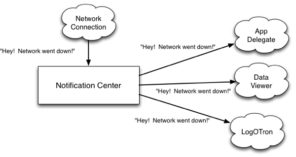

# Publisher

## Publisher?
-> Publisher는 Combine 프레임워크에서 제공하는 **비동기 데이터 스트림을 생성하는 객체**다.
-> **특정 값이 변경될 때마다 새로운 값을 방출**하는 역할을 함.
-> Publisher가 방출하는 데이터를 받아서 처리하는 게 Subscriber다.

```swift
protocol Publisher {
    associatedtype Output
    associatedtype Failure: Error

    func receive<S>(subscriber: S) where S : Subscriber, Self.Failure == S.Failure, Self.Output == S.Input
}
```
- Output : 방출하는 값의 타입
- Failure : 실패 시 반환할 에러 타입
-> 특정 타입의 값을 주기적으로 내보낼 수 있고, 실패할 수도 있는 존재

---

## NotificationCenter

<p align="center" style="color:gray">
  
  이미지출처: https://sidongmen.tistory.com/22
</p> 

  - 등록된 옵저버에 이벤트가 발생했을 때, 감지해서 해당 이벤트를 전달하는 메커니즘이라 한다. (공식문서 번역 이슈...ㅠ)

    >[!NOTE]
    > **갑자기 웬 NotificationCenter?**
    >```swift
    > //...
    >// 기존 NotificationCenter
    >// 입력 키보드가 나타날 때, 이벤트 발생
    >NotificationCenter.default.addObserver(
    >    self,
    >    selector : #selector(doSomething),
    >    name : UIResponder.keyboardWillShowNotification,
    >    object : nil)
    >
    > // with Combine
    > NotificationCenter.default.publisher(for : UIResponder.keyboardWillShowNotification)
    >.sink { _ in
    >    // doSomething
    > }
    > .store(in: $cancellables)
    > //...
    >```
    > - 기존 NotificationCenter를 Combine을 활용해 이벤트를 방출하는 Publisher로 구현할 수 있다.

## @Published

-> Swift에서 제공하는 Property Wrapper 중 하나이다.
```swift
// 연산 프로퍼티
class Cat {
    var croppedClawCount : Int = 0 {
        didSet {
            print("자른 발톱 수 : \(croppedClawCount)")
        }

        willSet {
            print("자를 발톱 수 : \(newValue)")
        }
    }
}
let blackCat = Cat()
cat.croppedClawCount = 4

// Published Property Wrapper
class Dog {
    @Published var croppedClawCount : Int = 0
}

let whiteDog = Dog()

whiteDog.$croppedClawCount
    .sink { count in
        print("자른 발톱 수 : \(count)")
    }
    .store(in: $cancellable)
```
- didSet, willSet은 인스턴스 내부에서만 값의 변경을 감지할 수 있다.
- 하지만, @Published의 경우 Combine을 활용할 수 있으며, 인스턴스 외부에서도 값 변경을 감지할 수 있다.(sink를 사용해 구독.)

--- 25.03.19
