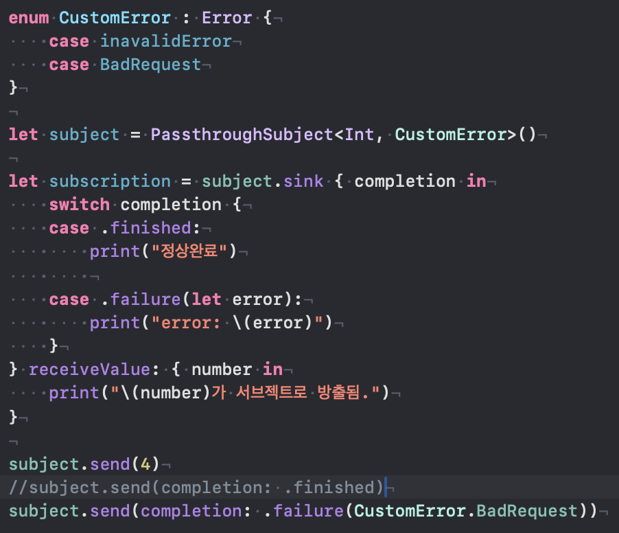
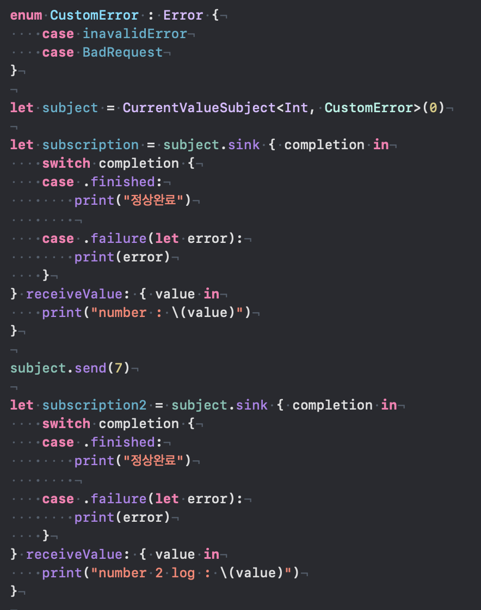
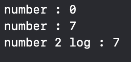

# Subject
- **Subject는 Publisher와 Subscriber의 역할을 동시에 하는 특수한 Publisher**
- Publisher처럼 데이터를 방출할 수 있으며,
- Subscriber처럼 데이터를 주입받을 수 있다.

---

- Subject는 외부에서 값을 주입받아(send) 이를 구독자에게 전달하는 역할을 한다.
- 데이터 스트림에서 동적인 이벤트 처리가 필요할 때 유용하게 사용된다.
- 여러 구독자에게 동일한 값을 전달하거나, UI 이벤트를 스트림으로 관리할 때, 네트워크 응답이나 비동기 이벤트를 Combine 스트림으로 전달할 때 등에 사용한다.

## PassthroughSubject

- 다운스트림 Subscriber에게 element를 전달한다.
- CurrentValueSubject와 달리, 초기값이나 버퍼를 가지지 않는다. 
- Subscriber가 없거나, 현재 수요가 0인 경우 값을 삭제한다.
- PassthrouSubject를 새로 구독하는 Subscriber는 이전 데이터를 전달받을 수 없으며, 구독 이후 방출된 데이터만 전달받을 수 있다. 

## CurrentValueSubject

- 하나의 값을 감싸고, 값이 변할때마다 publish 하는 서브젝트
- 초기값을 지정해야 한다.
- 새로운 구독자가 subject를 구독할 경우, 가장 최신 데이터를 전달받는다.
(위 로그 이미지를 보면 7로 전달한 값을 출력한다.)

## @Published vs CurrentValueSubject
