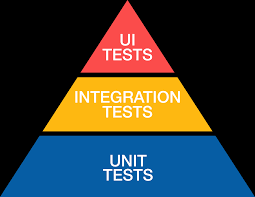

# Unit Test

## Test Pyramid

- Unit Test : 앱이 제공하는 기능을 작게 쪼개서 테스트한다. 테스트가 상대적으로 단순하고, 빠르게 실행된다.
- Intergration Test : 두 개 이상의 기능이 유기적으로 동작하는지 테스트. 데이터베이스, API 서버에 정상적으로 연결되는지도 통합 테스트에 포함된다.
Unit Test에 통과되었다고 해서 통합 테스트에 무조건 통과되는 것은 아니다. 
- UI Test : 사용자의 입장에서 기능과 동작을 확인하는 테스트.

## F.I.R.S.T
- Fast : 테스트가 빠르게 실행되도록 구현해야 한다.
- Independent : 테스트는 독립적으로 실행되어야 하며, 다른 테스트에 영향을 주면 안된다.
- Repeatable : 테스트는 반복적으로 실행할 수 있어야 하며, 외부 데이터나 환경에 관계없이 동일한 결과를 나타내야 한다.
- Self-validating : 하나의 테스트 안에서 성공과 실패를 명확히 도출해야 한다.
- Timely : 실제 코드를 작성하기 전에 테스트를 작성하거나, 동시에 작성하는 것이 원칙이다.

**TDD(Test Driven Development)에서 중요한 원칙 FIRST**

## 상태 검증과 행위 검증
- Unit Test에서 핵심은 성공이나 실패를 도출하는 것.
- 상태 검증 : 함수에 파라미터를 전달해서 결과를 도출하거나, 인스턴스를 초기화한 후 어떤 작업을 했을 때, 속성에 올바른 값이 저장되었는지 검증
- 행위 검증 : 주로 메소드가 예상대로 호출되는지 검증하는 방법.